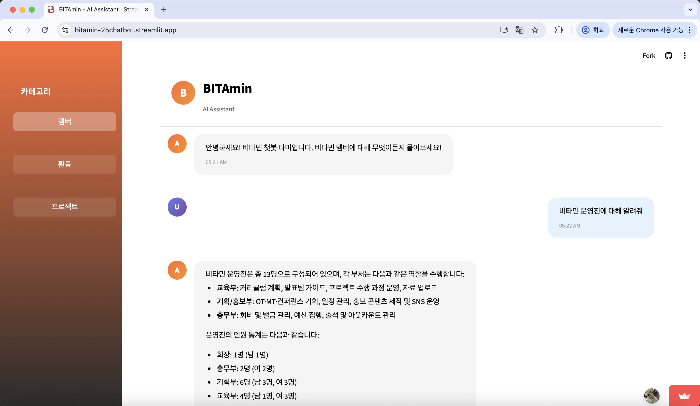
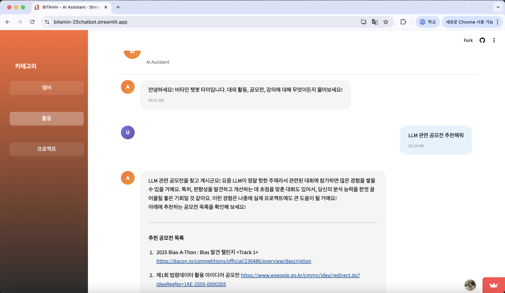
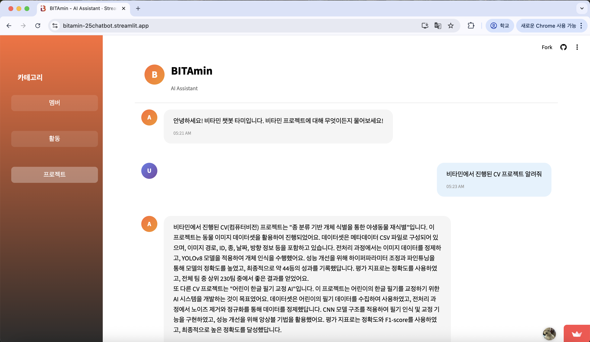

# BITAmin AI Chatbot

> 비타민 동아리를 위한 RAG 기반 AI 챗봇 서비스

비타민(BITAmin) 동아리의 멤버 정보, 프로젝트, 대외활동/공모전 정보를 자연어로 질문하고 답변받을 수 있는 AI 챗봇입니다.

---

## 1. 프로젝트 소개

3가지 카테고리로 나뉘어 각각 특화된 정보를 제공합니다:
- **멤버**: 비타민 동아리원 정보, 운영진 구성, 커리큘럼 등
- **활동**: 공모전, 대외활동, 강의 추천 등
- **프로젝트**: 비타민에서 진행한 프로젝트 정보

---

## 2. 서비스 화면

### 2-1. 멤버 카테고리
<!-- 멤버 카테고리 스크린샷 -->


### 2-2. 활동 카테고리
<!-- 활동 카테고리 스크린샷 -->


### 2-3. 프로젝트 카테고리
<!-- 프로젝트 카테고리 스크린샷 -->


---

## 3. 주요 기능

### 3-1. 멤버 정보 검색
- 비타민 동아리원 정보 조회
- 운영진 구성 및 역할 확인
- 기수별 멤버 정보
- 커리큘럼/세션 정보
- 동아리에서 진행되는 활동(OT, 소모임, 스터디)

### 3-2. 활동 정보 검색
- 공모전 정보 검색 및 추천
- 대외활동 정보 제공
- 온라인 강의 추천 (인프런, 캐글 등)
- 분야별 맞춤 추천

### 3-3. 프로젝트 정보 검색
- 비타민 프로젝트 히스토리
- 기수별/분야별 프로젝트 검색
- 프로젝트 상세 정보 (기술 스택, 팀 구성 등)

---

## 4. RAG 기법

### 4-1. Hybrid Retrieval (하이브리드 검색)
모든 카테고리에서 **BM25 + Vector Search (FAISS)** 를 결합한 하이브리드 검색 방식을 사용합니다.

| 검색 방식 | 특징 |
|-----------|------|
| **BM25** | 키워드 기반 검색, 정확한 용어 매칭에 강점 |
| **Vector Search (FAISS)** | 의미 기반 검색, 유사한 의미를 가진 문서 검색에 강점 |

### 4-2. 동적 가중치 조정
질문의 의도를 분석하여 BM25와 Vector Search의 가중치를 동적으로 조정합니다.

```
예시:
- 멤버 관련 질문 → Vector 비중 증가 (의미 기반 검색 강화)
- 특정 키워드 검색 → BM25 비중 증가 (정확한 매칭 강화)
```

### 4-3. Query Intent Classification
- **의미 기반 주제 분류**: OpenAI Embedding을 활용하여 질문을 카테고리별로 분류
- **질문 유형 분류기**: 질문 유형(추천, 정보 조회 등)에 따른 맞춤 응답 생성

### 4-4. 메타데이터 필터링
질문 의도에 따라 문서 타입(공모전, 대외활동, 강의 등)으로 필터링하여 정확도 향상

---

## 5. 팀원 및 담당 파트

| 담당 파트 | 팀원 | GitHub |
|-----------|------|--------|
| **멤버 RAG, Streamlit 구현** | 장민지 | [@GitHub](https://github.com/rossenzii) |
| **활동/공모전 RAG** | 백진웅 | [@GitHub](https://github.com/woongjin9293-crypto) |
| **프로젝트 RAG** | 조혜림 | [@GitHub](https://github.com/johyerim23) |

---

## 6. 데이터 출처

- **멤버 정보**: 비타민 내부 데이터
- **공모전/대외활동**: 데이콘, 링커리어, 공공데이터포털, LH COMPAS 등
- **강의 정보**: 인프런, 캐글
- **프로젝트 정보**: 비타민 프로젝트 아카이브

---

## 7. 향후 발전 방향

### 7-1. 자동 데이터 크롤링 파이프라인 구축
- 공모전/대외활동 정보를 주기적으로 자동 수집하는 크롤링 파이프라인 추가
- 신규 데이터 수집 시 FAISS 인덱스 자동 업데이트
- 스케줄러를 통한 일/주 단위 데이터 갱신
- 동아리 홈페이지에 챗봇 기능 추가

### 7-2. 검색 성능 고도화
- Reranker 모델 도입을 통한 검색 정확도 향상
- Query Expansion 기법 적용
- 사용자 피드백 기반 검색 결과 개선

### 7-3. 데이터 확장
- 비타민 졸업생 네트워크 정보 추가
- 스터디/소모임 정보 데이터베이스화
- 외부 데이터 소스 연동 확대


